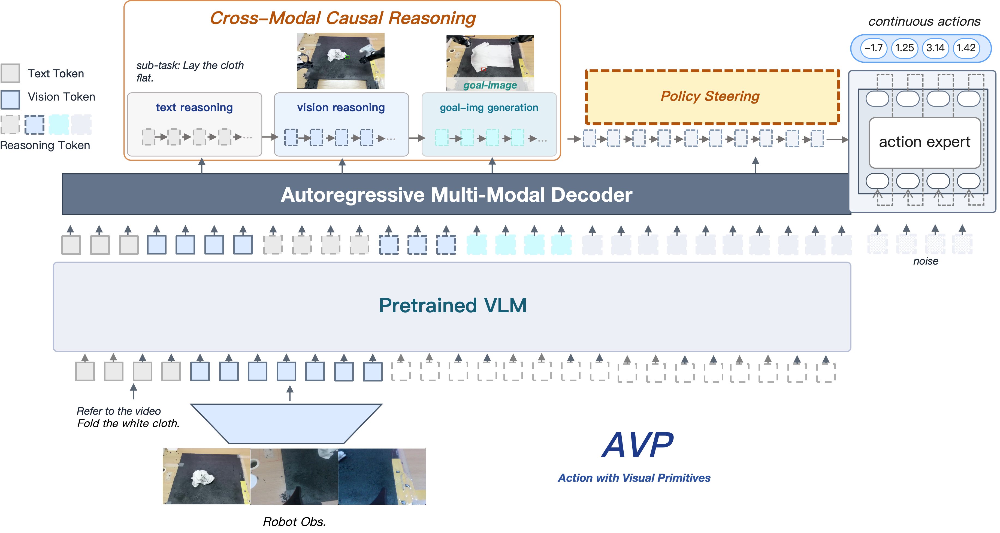
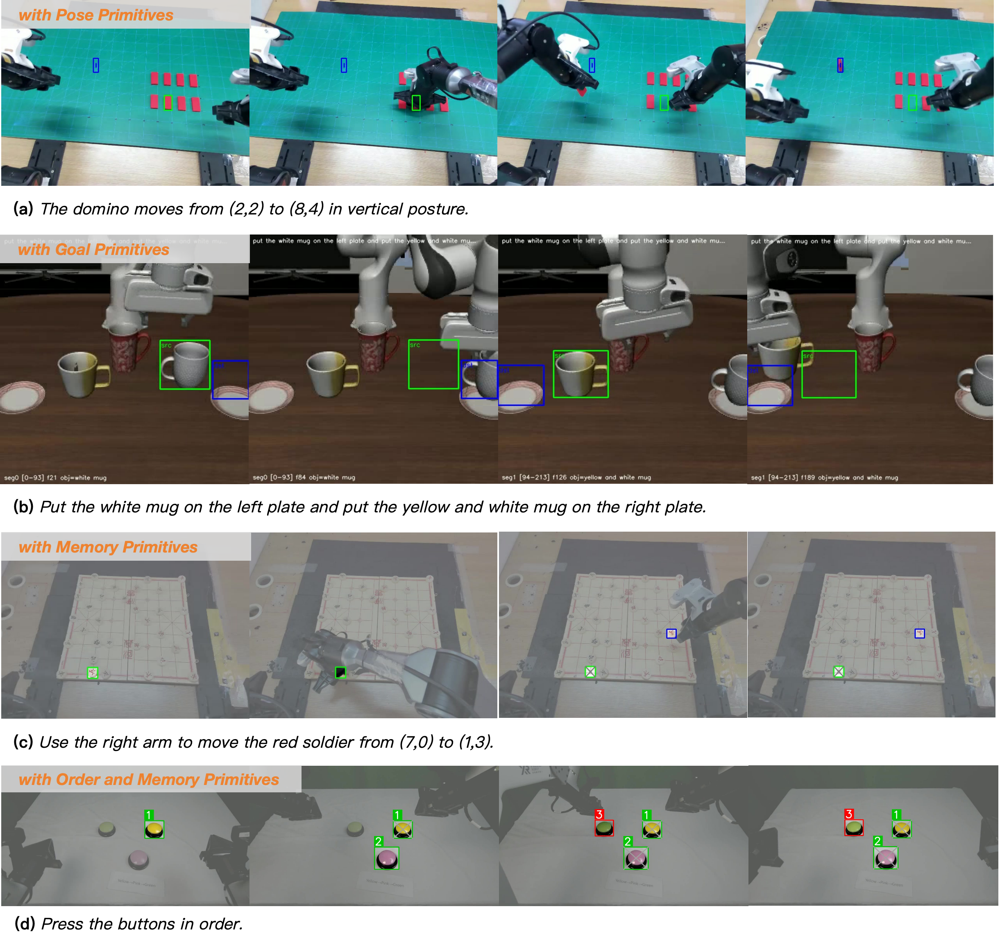

# Action with Visual Primitives (AVP)

**Project page · Preprint, 2026**

🌐 **Live site:** [kingdroper.github.io/AVP](https://kingdroper.github.io/AVP/)

<p align="center">
  
</p>

---

## TL;DR

Vision-Language-Action (VLA) models commonly map language instructions and
visual observations to actions in a *single forward pass*. While conceptually
simple, this entangles instruction comprehension, spatial scene understanding,
and motor control within one learning objective, so the action expert must
implicitly relearn cognitive and perceptual capabilities already present in the
pretrained VLM.

We propose **AVP (Action with Visual Primitives)**, an end-to-end VLA
architecture with a **visual-primitive-centric interface** between the VLM and
the action expert: the VLM infers the next-stage target and emits compact,
spatially grounded primitive tokens (points, boxes, sub-goal markers,
memory-and-order anchors); the action expert consumes these tokens and focuses
solely on kinematic mapping. Primitive supervision is derived directly from
end-effector kinematics, eliminating the need for manual spatial annotation.

On real-robot pick-and-place tasks, AVP improves success rate by **27.61% over
π₀.₅** and outperforms other recent methods, with consistent gains in data
efficiency, spatial-compositional generalization, and object-level transfer.

## Key ideas

- **Explicit VLM ↔ action-expert interface.** A *Policy Steering* channel
  carries visual primitives from a reasoning-capable VLM to a flow-matching
  action expert, demarcating their learning responsibilities and avoiding
  duplicated perception inside the policy.
- **Form-agnostic primitive protocol.** Points, bounding boxes, sub-goal
  markers, memory primitives, and order-and-memory primitives all flow through
  the same interface — without changing the underlying policy architecture.
- **Kinematics-derived supervision.** Ground-truth primitives are projected
  from the recorded end-effector trajectory plus a one-time camera
  calibration, so the supervision pipeline scales to new platforms at
  essentially zero additional annotation cost.

## Visual primitives we study

<p align="center">
  
</p>

1. **Pose Primitives** — single-step end-effector anchors (grasp + placement).
2. **Goal Primitives** — (source, destination) region pairs per sub-task.
3. **Memory Primitives** — markers that persist across frames so the model can
   refer to objects that have left the field of view.
4. **Order + Memory Primitives** — explicit indices (1 → 2 → 3, turning red
   once executed) for sequential targeting.

## Demos

The project page hosts real-robot rollouts on:

| Task | Highlights |
|---|---|
| Chinese chess manipulation | Dense-board sequential moves |
| Multi-instruction composition (red / black) | Chained instructions in one rollout |
| Cross-domain generalization | Zero-shot transfer to unseen objects and backgrounds |
| Snake-game sequential targeting | Long-horizon ordered targeting via memory-and-order primitives |

See them in action on the [live project page](https://kingdroper.github.io/AVP/#demos).

## Authors

<sub><sup>*</sup>Equal contribution &nbsp;·&nbsp; <sup>†</sup>Project Leader &nbsp;·&nbsp; <sup>‡</sup>Corresponding author</sub>

| | Affiliation |
|---|---|
| **Weilong Guo**<sup>\*†‡</sup> | Anyverse Dynamics |
| **Yuchen Wang**<sup>\*</sup> | Tsinghua University |
| Renping Zhou | Tsinghua University |
| Yunfeng Zhang | Anyverse Dynamics |
| Rui Fang | Anyverse Dynamics |
| Yuyang Pang | Anyverse Dynamics |
| Yue Meng | Anyverse Dynamics |
| **Wenda Xu**<sup>‡</sup> | Anyverse Dynamics |
<!-- | Yuan He | Tsinghua University | -->
| **Gao Huang**<sup>‡</sup> | Tsinghua University |

## Citation

```bibtex
@article{guo2026avp,
  title   = {Action with Visual Primitives},
  author  = {Guo, Weilong and Wang, Yuchen and Zhou, Renping and Zhang, Yunfeng
             and Fang, Rui and Meng, Yue and Xu, Wenda and He, Yuan and Huang, Gao},
  journal = {arXiv preprint},
  year    = {2026}
}
```

---

## About this repository

This repo hosts the static [project page](https://kingdroper.github.io/AVP/)
for AVP. No build step — plain HTML / CSS / JS deployed via GitHub Pages.

### Local preview

```bash
git clone https://github.com/Kingdroper/AVP.git
cd AVP
python3 -m http.server 8000
# open http://localhost:8000
```

### Layout

```
AVP/
├── index.html               main page
├── README.md                this file
├── .nojekyll                tells GitHub Pages to skip Jekyll
└── static/
    ├── css/style.css        dark-theme styling + animations
    ├── js/main.js           scroll reveal + bibtex copy
    ├── images/              framework & primitives figures
    └── videos/              demo clips (web-optimized) + posters
```

### Adding a new demo video

See `static/videos/README.md` for the ffmpeg one-liner used to compress clips
for web playback, and for the HTML snippet that swaps a placeholder tile for a
real `<video>` element.
